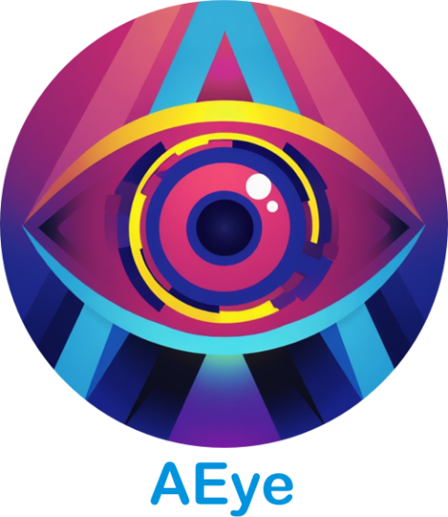

# 🤖 AEye - AI Vision Chrome Extension

## 🌟 Project Overview

AEye is an innovative Chrome extension that brings powerful AI capabilities directly to your browser, transforming how you interact with artificial intelligence.

## ✨ Key Features

- 🤖 Multiple AI Models:
  - Grok 2 and Grok 2 Vision
  - Ollama Models (Llama 2, LLaVA, Mistral, Mixtral)
- 🖼️ Image Analysis: Upload and analyze images using Grok Vision or LLaVA
- 💬 Natural Language Chat: Interact with AI through a user-friendly chat interface
- 🎨 Modern UI: Beautiful gradient-based design with smooth animations
- 🔄 Context Awareness: Maintains chat history and scroll position
- 📱 Responsive Design: Works seamlessly across different screen sizes
- 🔒 Secure API Key Management
- 🌐 Browser-Wide Accessibility

## 📸 Screenshot

## 📦 Installation Methods

### 1. Graphical Installation
- Download ZIP from GitHub
- Load as unpacked Chrome extension
- Detailed steps in [INSTALL.md](INSTALL.md)

### 2. Command-Line Installation
- Use PowerShell
- Git-based repository cloning
- Automated extension loading script

## 🛠 Prerequisites

- Windows 10/11
- Google Chrome
- Git
- PowerShell
- Grok API Key
- Ollama (optional, for local models)

## 🚀 Getting Started

1. Install the extension
2. Click the settings icon (⚙️)
3. Enter your Grok API Key
4. (Optional) Enter your Ollama URL (e.g., http://localhost:11434)
5. Select your preferred model from the dropdown
6. Start chatting!

## 📝 License

[Specify License]

## 🌈 About CloudWerx Lab

**Motto**: "Digital Food for the Analog Soul"

**Connect with Us**:
- Website: [cloudwerxlab.com](http://cloudwerxlab.com)
- GitHub: [@CloudWerxLabs](https://github.com/CloudWerxLabs)
- X (Twitter): [@CloudwerxLab](https://x.com/CloudwerxLab)

---

**Made with ❤️ by CLOUDWERX LAB**
